# Especificación funcional y técnica

## Sistema de gestión de mantenimiento de equipos

**Versión:** 1.1  
**Fecha:** 5 de agosto de 2026  
**Estado:** Documento base para desarrollo  
**Objetivo:** definir la primera versión operativa del sistema y evitar interpretaciones ambiguas de alcance.

**Criterio de diseño:** la versión 1.1 incorpora el contraste realizado con sistemas CMMS y de mantenimiento de flotas consolidados, además de problemas de adopción informados por usuarios de mantenimiento. Se prioriza un circuito simple, móvil y trazable antes que una acumulación de funciones administrativas.

---

## 1. Objetivo del sistema

Desarrollar una aplicación web para administrar el mantenimiento preventivo y correctivo de una flota compuesta por:

- Camiones y tractores.
- Acoplados y semirremolques.
- Máquinas.
- Vehículos livianos.
- Otros tipos de equipo que puedan incorporarse posteriormente.

El sistema deberá permitir conocer qué mantenimientos están próximos o vencidos, emitir órdenes de trabajo, registrar los trabajos y repuestos utilizados y consultar el historial completo de cada equipo.

La solución debe admitir varias sucursales y aproximadamente cinco o seis usuarios en la primera etapa, sin establecer límites artificiales que impidan su crecimiento.

---

## 2. Alcance de la primera versión

### 2.1 Funciones incluidas

1. Empresas y sucursales.
2. Usuarios, roles y acceso por sucursal.
3. Catálogo general de equipos.
4. Tipos de equipo configurables.
5. Relación temporal entre tractores y acoplados.
6. Registro manual de kilometraje y horómetro.
7. Importación básica de equipos y lecturas mediante CSV o Excel.
8. Tipos de servicio, tareas y plantillas de mantenimiento.
9. Planes preventivos por fecha, kilómetros, horas o una combinación de criterios.
10. Cálculo de mantenimientos próximos y vencidos.
11. Órdenes de trabajo para taller propio o proveedor externo.
12. Impresión y generación de PDF de órdenes de trabajo.
13. Registro de diagnóstico, trabajos realizados, repuestos y costos.
14. Información básica para seguimiento de garantías.
15. Historial de mantenimiento por equipo.
16. Panel de control y reportes básicos.
17. Alertas por correo electrónico.
18. Archivos adjuntos.
19. Auditoría de operaciones importantes.
20. Solicitudes de mantenimiento o fallas separadas de las órdenes de trabajo.
21. Revisión, aprobación, postergación, agrupación y rechazo justificado de solicitudes.
22. Asignación de responsable y seguimiento de tiempos de atención.
23. Comentarios y novedades cronológicas dentro de solicitudes y órdenes.
24. Acceso rápido desde teléfono para informar una falla con fotografía.
25. Identificación del equipo mediante código QR como facilidad de acceso, sin requerir una aplicación nativa.

### 2.2 Fuera de alcance

No forman parte de esta primera versión:

- Integración directa con Gestya u otros sistemas mediante API.
- Inventario completo, depósitos y movimientos de stock.
- Compras, cuentas corrientes o pagos a proveedores.
- Gestión integral de choferes y documentación del personal.
- Gestión de neumáticos por posición.
- GPS, telemetría o captura automática de lecturas.
- Alertas por WhatsApp.
- Aplicación móvil nativa.
- Trabajo sin conexión u operación offline.
- Portal para proveedores externos.
- Presupuestos y autorizaciones de reparación avanzadas.
- Costos presupuestados versus reales avanzados.
- Funciones contables o de facturación.

Estas funciones podrán desarrollarse posteriormente mediante presupuestos separados.

### 2.3 Circuito funcional completo

El siguiente diagrama resume el recorrido principal que debe soportar la primera versión:

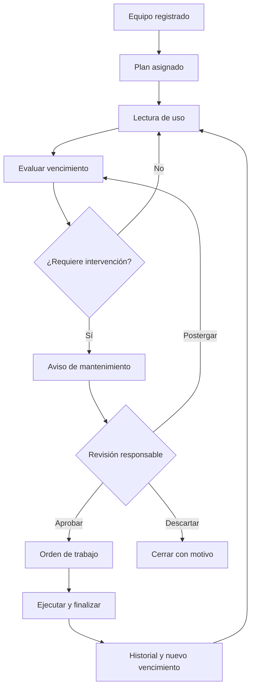

Una orden también podrá originarse directamente por una falla, una inspección, una garantía o una carga manual, sin esperar un vencimiento preventivo.

### 2.4 Principios operativos obligatorios

1. **La solicitud no es una orden.** Una falla, observación o pedido debe poder registrarse rápidamente y luego ser revisado antes de consumir recursos del taller.
2. **La carga de campo debe ser breve.** Informar una falla no debe exigir completar datos propios de planificación, costos o cierre.
3. **No generar órdenes masivas sin revisión.** Los vencimientos crean avisos accionables; una regla configurable puede agrupar avisos del mismo equipo y evitar duplicados.
4. **El técnico trabaja desde una lista personal.** Debe ver primero sus órdenes asignadas, prioridad, equipo, ubicación y bloqueo actual.
5. **El cierre debe producir datos útiles.** No se admitirá finalizar con una observación vacía o genérica: se requiere trabajo realizado, resultado, lecturas aplicables y causa cuando sea correctivo.
6. **Las notificaciones deben ser accionables.** Se priorizan resúmenes y cambios relevantes; no se enviará un correo por cada modificación menor.
7. **El sistema debe funcionar correctamente en navegador móvil.** La primera versión no incluye aplicación nativa ni modo sin conexión.

---

## 3. Decisiones técnicas

### 3.1 Arquitectura propuesta

- PHP 8.2 o superior. El alojamiento actual dispone de PHP 8.4 FPM.
- CodeIgniter 4.
- MySQL o MariaDB.
- Aplicación monolítica con vistas renderizadas en servidor.
- Bootstrap 5 para la interfaz.
- JavaScript liviano o Alpine.js para interacciones puntuales.
- Composer utilizado durante el desarrollo; el despliegue debe incluir `vendor/` cuando el servidor no permita ejecutarlo.
- Dompdf o alternativa compatible para PDF.
- PhpSpreadsheet o alternativa compatible para Excel/CSV.
- SMTP autenticado para correos.
- Tareas programadas de Ferozo para el proceso diario de alertas.

No se desarrollará un frontend separado ni una API completa en esta etapa. La estructura interna deberá permitir incorporar una API en el futuro.

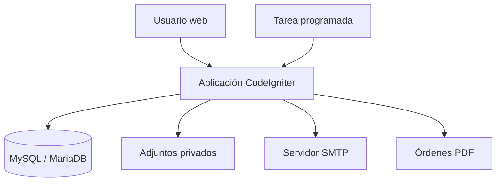

### 3.2 Requisitos del alojamiento conocidos

- `public_html` como directorio público.
- Uso de `.htaccess` y URL rewriting.
- PHP 8.4 FPM.
- Zona horaria `America/Argentina/Buenos_Aires`.
- Memoria PHP: 512 MB.
- Tiempo máximo de ejecución web: 60 segundos.
- Tamaño máximo de subida y POST: 128 MB.
- Panel Ferozo con tareas programadas.

### 3.3 Organización sugerida

Separar la aplicación por dominios funcionales, aunque continúe siendo un monolito:

```text
App
├── Empresas y sucursales
├── Usuarios y permisos
├── Equipos
├── Lecturas
├── Planes de mantenimiento
├── Órdenes de trabajo
├── Repuestos y garantías
├── Proveedores y talleres
├── Importaciones
├── Alertas
├── Reportes
└── Auditoría
```

---

## 4. Roles y permisos

### 4.1 Roles iniciales

| Rol | Permisos principales |
|---|---|
| Administrador | Acceso completo, configuración, usuarios, catálogos, auditoría y anulaciones. |
| Responsable de mantenimiento | Equipos, lecturas, planes, órdenes, trabajos, repuestos, garantías y reportes. |
| Técnico u operador | Consultar trabajo asignado, cargar lecturas, iniciar, actualizar y cerrar tareas u órdenes según autorización. |
| Solicitante | Informar fallas o necesidades, adjuntar evidencia y consultar el estado de sus solicitudes. |
| Consulta | Visualizar paneles, equipos, órdenes e historial sin modificar información. |

### 4.2 Reglas de acceso

- Un usuario puede estar habilitado para una o varias sucursales.
- El administrador puede consultar todas las sucursales autorizadas.
- Los listados y reportes deben respetar las sucursales asignadas al usuario.
- Las acciones críticas deben verificarse en el servidor, no solamente ocultarse en la interfaz.
- Como mínimo, anular órdenes, modificar una orden finalizada y cambiar lecturas históricas requieren permiso específico.

---

## 5. Modelo de datos propuesto

Todas las tablas principales deberán utilizar claves primarias numéricas o UUID de manera coherente. Deben incluir `created_at`, `updated_at` y, cuando corresponda, `deleted_at`, `created_by` y `updated_by`.

Los importes se almacenarán con `DECIMAL`, nunca con tipos de punto flotante. Las fechas y horas se guardarán de forma consistente y se presentarán en la zona horaria de Argentina.

### 5.1 Organización y seguridad

| Tabla | Finalidad | Campos esenciales |
|---|---|---|
| `empresas` | Identifica la organización propietaria de los datos y permite crecer a un esquema multiempresa. | id, razon_social, nombre_fantasia, cuit, email, telefono, estado |
| `sucursales` | Representa bases, talleres o ubicaciones operativas. | id, empresa_id, codigo, nombre, direccion, email_alertas, estado |
| `usuarios` | Credenciales y datos de acceso. | id, nombre, email, password_hash, activo, ultimo_acceso |
| `roles` | Define perfiles de permisos. | id, nombre, descripcion |
| `permisos` | Define acciones autorizables. | id, clave, descripcion |
| `usuario_roles` | Permite asignar uno o más roles a un usuario. | usuario_id, rol_id |
| `rol_permisos` | Relaciona roles con permisos. | rol_id, permiso_id |
| `usuario_sucursales` | Limita la información visible y editable por sucursal. | usuario_id, sucursal_id |

**Motivo del diseño:** separar roles, permisos y sucursales evita permisos escritos rígidamente en el código y permite ampliar perfiles sin modificar el modelo.

### 5.2 Equipos

| Tabla | Finalidad | Campos esenciales |
|---|---|---|
| `tipos_equipo` | Catálogo configurable de camiones, acoplados, máquinas, livianos y futuros tipos. | id, nombre, controla_km, controla_horas, activo |
| `marcas` | Normaliza las marcas para filtros y reportes. | id, nombre, activo |
| `modelos` | Modelos asociados opcionalmente a una marca y tipo. | id, marca_id, tipo_equipo_id, nombre, activo |
| `equipos` | Ficha principal de cada unidad mantenible. | id, empresa_id, sucursal_id, tipo_equipo_id, codigo, patente, marca_id, modelo_id, anio, chasis, motor, km_actual, horas_actuales, estado, fecha_alta, fecha_baja, observaciones |
| `equipo_adjuntos` | Fotografías, manuales y documentos relacionados con el equipo. | id, equipo_id, tipo, nombre_original, ruta_privada, mime_type, tamanio, descripcion |
| `equipo_relaciones` | Conserva la vinculación temporal entre tractor y acoplado. | id, equipo_principal_id, equipo_relacionado_id, tipo_relacion, desde, hasta, usuario_id, observaciones |
| `equipo_sucursal_historial` | Conserva los cambios de sucursal. | id, equipo_id, sucursal_origen_id, sucursal_destino_id, fecha_movimiento, usuario_id, observaciones |

**Motivo del diseño:** se utiliza una sola entidad `equipos` porque todos los elementos poseen historial y mantenimiento. Los datos particulares se controlan por tipo y pueden ampliarse sin crear procesos duplicados para cada clase.

### 5.3 Lecturas de uso

| Tabla | Finalidad | Campos esenciales |
|---|---|---|
| `lecturas_equipo` | Conserva todas las lecturas de kilómetros y horómetro. | id, equipo_id, fecha_lectura, kilometraje, horometro, origen, referencia_importacion_id, usuario_id, observaciones, anulada |

**Motivo del diseño:** `km_actual` y `horas_actuales` en `equipos` facilitan los listados, pero `lecturas_equipo` es la fuente del historial y permite auditar cambios e importaciones.

Reglas:

- Una lectura puede contener kilometraje, horómetro o ambos.
- Al menos uno debe estar informado.
- No se aceptan valores negativos.
- No se aceptan retrocesos respecto de la última lectura válida, salvo permiso especial y justificación obligatoria.
- Una lectura histórica corregida debe quedar auditada.
- Al confirmar la lectura se actualizan los valores actuales del equipo dentro de la misma transacción.

### 5.4 Catálogo de mantenimiento

| Tabla | Finalidad | Campos esenciales |
|---|---|---|
| `tipos_servicio` | Agrupa trabajos frecuentes, por ejemplo service de motor o inspección. | id, codigo, nombre, descripcion, activo |
| `tareas_mantenimiento` | Catálogo reutilizable de tareas concretas. | id, codigo, nombre, descripcion, procedimiento, duracion_estimada_min, requiere_repuesto, requiere_control, requiere_foto, activo |
| `tipo_servicio_tareas` | Define qué tareas integran un tipo de servicio y su orden. | tipo_servicio_id, tarea_id, orden, obligatoria, observaciones |
| `plantillas_mantenimiento` | Configuración reutilizable por tipo, marca o modelo. | id, nombre, tipo_equipo_id, marca_id, modelo_id, descripcion, activo |
| `plantilla_items` | Servicios e intervalos incluidos en una plantilla. | id, plantilla_id, tipo_servicio_id, intervalo_km, intervalo_horas, intervalo_dias, anticipacion_km, anticipacion_horas, anticipacion_dias, prioridad |

**Motivo del diseño:** separar servicios, tareas y plantillas permite reutilizar configuraciones. Por ejemplo, un service puede incluir varias tareas y aplicarse a todos los equipos de un modelo sin cargarlas individualmente.

### 5.5 Planes preventivos

| Tabla | Finalidad | Campos esenciales |
|---|---|---|
| `planes_mantenimiento` | Configura el mantenimiento periódico concreto de un equipo. | id, equipo_id, tipo_servicio_id, origen_plantilla_id, intervalo_km, intervalo_horas, intervalo_dias, anticipacion_km, anticipacion_horas, anticipacion_dias, base_km, base_horas, base_fecha, proximo_km, proximas_horas, proxima_fecha, prioridad, activo, observaciones |
| `plan_repuestos_sugeridos` | Lista opcional de repuestos habituales para preparar el trabajo. | id, plan_id, codigo, descripcion, cantidad, observaciones |

**Motivo del diseño:** cada equipo puede heredar una plantilla, pero el plan queda materializado para permitir excepciones individuales sin alterar los demás equipos.

#### Relaciones centrales del mantenimiento

Este esquema no reemplaza las migraciones, pero muestra las dependencias que el programador debe preservar:

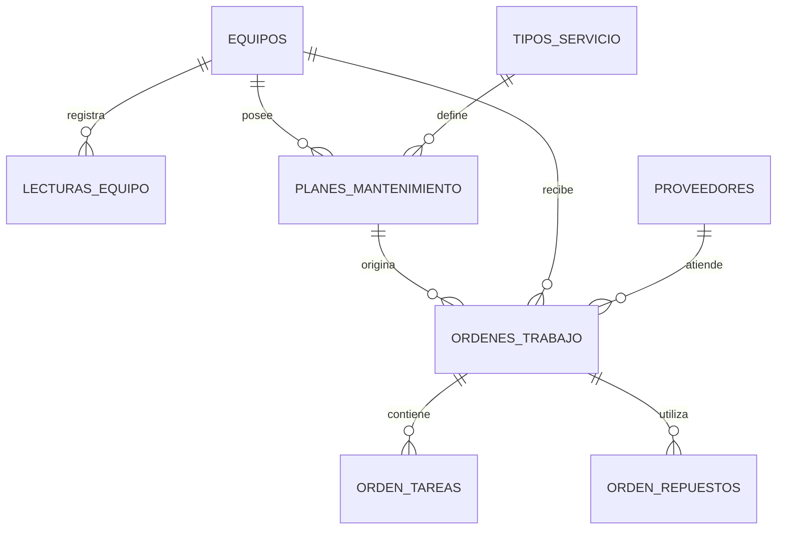

#### Regla de vencimiento combinado

Un plan puede utilizar uno o varios criterios:

- Fecha.
- Kilometraje.
- Horómetro.

Si se configuran varios criterios, el mantenimiento se considera vencido cuando se alcanza **cualquiera** de ellos. No se debe esperar a que todos estén vencidos.

Estados calculados:

- `SIN_DATOS`: falta una lectura necesaria para evaluar el plan.
- `AL_DIA`: ningún criterio ingresó en su rango de aviso.
- `PROXIMO`: al menos un criterio ingresó en su anticipación.
- `VENCIDO`: al menos un criterio alcanzó o superó su próximo valor.

Ejemplo:

```text
Próximo service: 100.000 km o 01/12/2026
Lectura actual: 98.500 km
Fecha actual: 05/12/2026
Resultado: VENCIDO por fecha, aunque todavía no llegó a 100.000 km.
```

Cuando una orden preventiva se finaliza, el sistema debe actualizar las bases del plan con la fecha y las lecturas de salida de la orden y recalcular sus próximos vencimientos.

#### Flujo de carga de una lectura

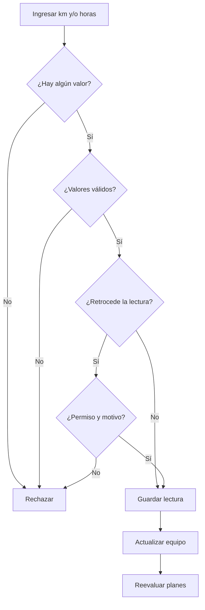

#### Decisión del estado de un plan

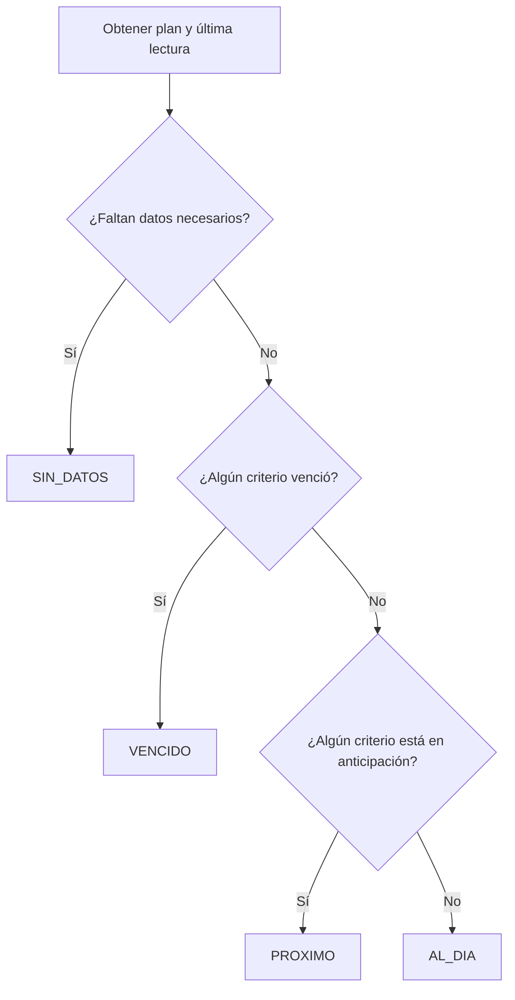

### 5.6 Proveedores y talleres

| Tabla | Finalidad | Campos esenciales |
|---|---|---|
| `proveedores` | Catálogo de talleres y proveedores de repuestos. | id, empresa_id, razon_social, cuit, es_taller, es_proveedor, email, telefono, direccion, especialidad, activo, observaciones |
| `talleres_propios` | Identifica talleres internos asociados a una sucursal. | id, sucursal_id, nombre, responsable, email, telefono, activo |

**Motivo del diseño:** una orden debe distinguir claramente si el trabajo se realiza internamente o por un tercero, sin implementar todavía compras ni cuentas corrientes.

### 5.7 Solicitudes, fallas y avisos

| Tabla | Finalidad | Campos esenciales |
|---|---|---|
| `solicitudes_mantenimiento` | Registra una falla, inspección, observación o necesidad antes de decidir si corresponde una orden. | id, numero, empresa_id, sucursal_id, equipo_id, origen, titulo, descripcion, prioridad_solicitada, criticidad_operativa, equipo_puede_operar, solicitante_usuario_id, solicitante_nombre, fecha_solicitud, estado, responsable_revision_id, fecha_revision, decision, motivo_decision, solicitud_padre_id |
| `solicitud_adjuntos` | Conserva fotografías, videos cortos o documentos que ayuden a identificar el problema. | id, solicitud_id, nombre_original, ruta_privada, mime_type, tamanio, descripcion |
| `solicitud_comentarios` | Registra aclaraciones y novedades sin sobrescribir la descripción original. | id, solicitud_id, usuario_id, comentario, fecha, es_interno |
| `avisos_plan` | Materializa o registra el evento de un plan próximo/vencido para revisión, agrupación e idempotencia. | id, plan_id, equipo_id, estado_calculado, criterio_disparador, fecha_deteccion, valor_actual, valor_objetivo, estado_gestion, orden_id, fecha_resolucion |

**Motivo del diseño:** los productos maduros distinguen el problema o recordatorio del trabajo autorizado. Esta separación evita dos extremos frecuentes: que nadie registre fallas porque el formulario es largo, o que cada aviso genere automáticamente una orden y oculte los problemas importantes entre duplicados.

Estados de solicitud recomendados:

- `NUEVA`.
- `EN_REVISION`.
- `APROBADA`.
- `POSTERGADA`.
- `AGRUPADA`.
- `RECHAZADA`.
- `CONVERTIDA_OT`.

Reglas:

- La carga rápida requiere solamente equipo, título o descripción, condición operativa y, opcionalmente, fotografía.
- La prioridad final la define el responsable; la indicada por el solicitante es orientativa.
- Antes de crear una solicitud se deben mostrar posibles duplicados abiertos del mismo equipo.
- El responsable puede agrupar solicitudes relacionadas; nunca deben eliminarse ni perder su autoría.
- Aprobar no obliga a crear la orden inmediatamente: puede dejarse programada con responsable y fecha objetivo.
- Rechazar, postergar o agrupar requiere un motivo.
- La solicitud debe conservar un enlace a la orden resultante y la orden a sus solicitudes de origen.

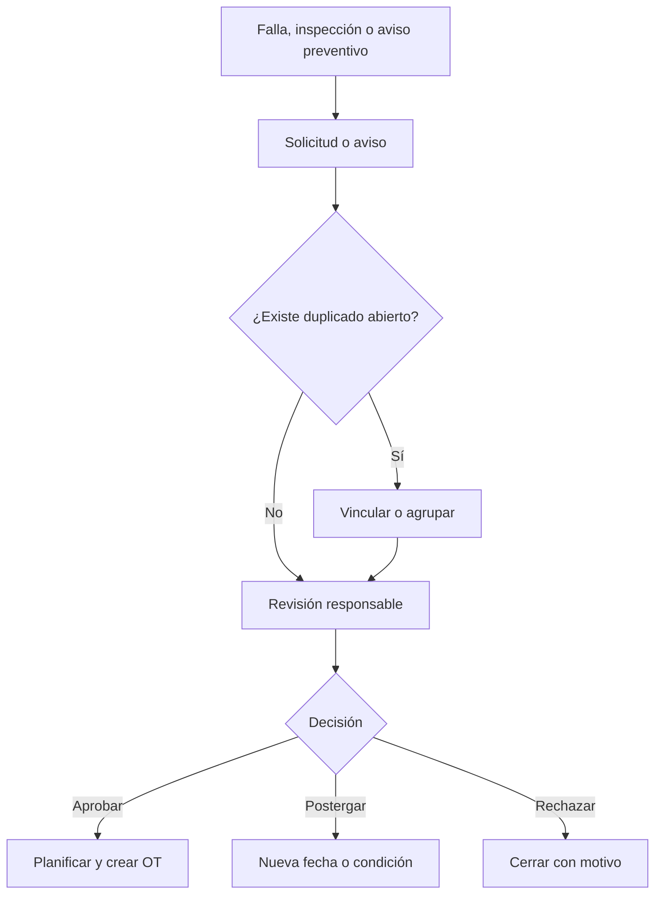

### 5.8 Órdenes de trabajo

| Tabla | Finalidad | Campos esenciales |
|---|---|---|
| `ordenes_trabajo` | Encabezado y estado de cada intervención. | id, numero, empresa_id, sucursal_id, equipo_id, origen, plan_id, prioridad, criticidad, responsable_usuario_id, fecha_apertura, fecha_objetivo, fecha_programada, fecha_inicio, fecha_finalizacion, tipo_taller, taller_propio_id, proveedor_id, chofer_momento, km_ingreso, horas_ingreso, km_salida, horas_salida, falla_informada, diagnostico, causa_codigo, resultado_codigo, estado, motivo_espera, equipo_fuera_servicio, inicio_detencion, fin_detencion, costo_mano_obra, costo_repuestos, otros_costos, costo_total, observaciones |
| `orden_solicitudes` | Vincula una orden con una o varias solicitudes o avisos que serán atendidos juntos. | orden_id, solicitud_id, es_principal |
| `orden_tareas` | Trabajos solicitados y resultado de cada tarea. | id, orden_id, tarea_id, descripcion_solicitada, trabajo_realizado, estado, responsable, fecha_inicio, fecha_fin, observaciones |
| `orden_repuestos` | Repuestos utilizados en la intervención. | id, orden_id, orden_tarea_id, codigo, descripcion, marca, numero_serie_lote, cantidad, precio_unitario, proveedor_id, comprobante, fecha_colocacion, garantia_fecha, garantia_km, garantia_horas, repuesto_retirado, observaciones |
| `orden_adjuntos` | Facturas, fotografías, presupuestos y comprobantes. | id, orden_id, tipo, nombre_original, ruta_privada, mime_type, tamanio, descripcion |
| `orden_estado_historial` | Auditoría funcional de cambios de estado. | id, orden_id, estado_anterior, estado_nuevo, fecha, usuario_id, comentario |

**Motivo del diseño:** el encabezado concentra los datos generales; tareas, repuestos, adjuntos e historial son relaciones uno a muchos y no deben almacenarse como texto o JSON dentro de la orden.

#### Numeración

- El número debe ser único dentro de la empresa.
- Formato sugerido: `OT-AAAA-000001`.
- La generación debe ser transaccional para evitar duplicados.

#### Orígenes posibles

- Preventivo próximo.
- Preventivo vencido.
- Correctivo.
- Inspección.
- Garantía.
- Carga manual.

#### Estados y transiciones

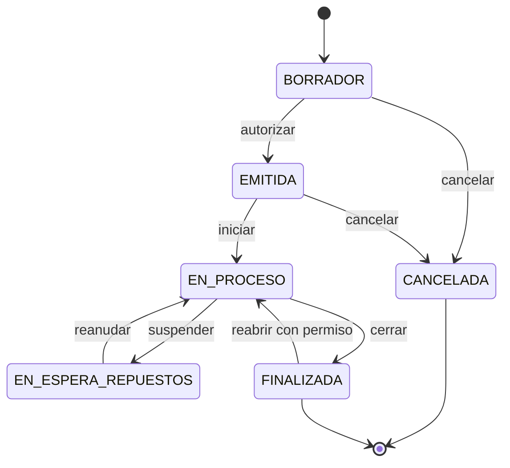

Reglas:

- Una orden finalizada no se elimina.
- Para finalizar se requieren fecha, lecturas de salida y al menos un trabajo realizado.
- En una orden correctiva se requiere causa, acción realizada y resultado; se evitarán cierres con textos genéricos como “listo” o “reparado”.
- Las lecturas de salida no pueden ser inferiores a las de ingreso.
- Al finalizar, se registra una nueva lectura del equipo si corresponde.
- Si la orden está relacionada con un plan, se recalcula el próximo vencimiento.
- Una orden cancelada requiere motivo.
- Reabrir una orden finalizada requiere permiso especial, motivo y auditoría.
- El costo total debe calcularse como mano de obra + repuestos + otros costos.
- El chofer se registra como texto histórico opcional; no implica desarrollar la gestión completa de choferes.
- Debe registrarse quién tiene asignada la orden y la fecha objetivo.
- El estado de espera exige un motivo: repuesto, proveedor, autorización, disponibilidad del equipo u otro.
- Cuando el equipo quede detenido, se deben guardar inicio y fin de detención para no inferir indisponibilidad a partir de datos incompletos.
- Una orden puede resolver varias solicitudes del mismo equipo, pero no puede cerrar solicitudes ajenas sin dejar el vínculo y el resultado.

#### Origen y autorización de una orden

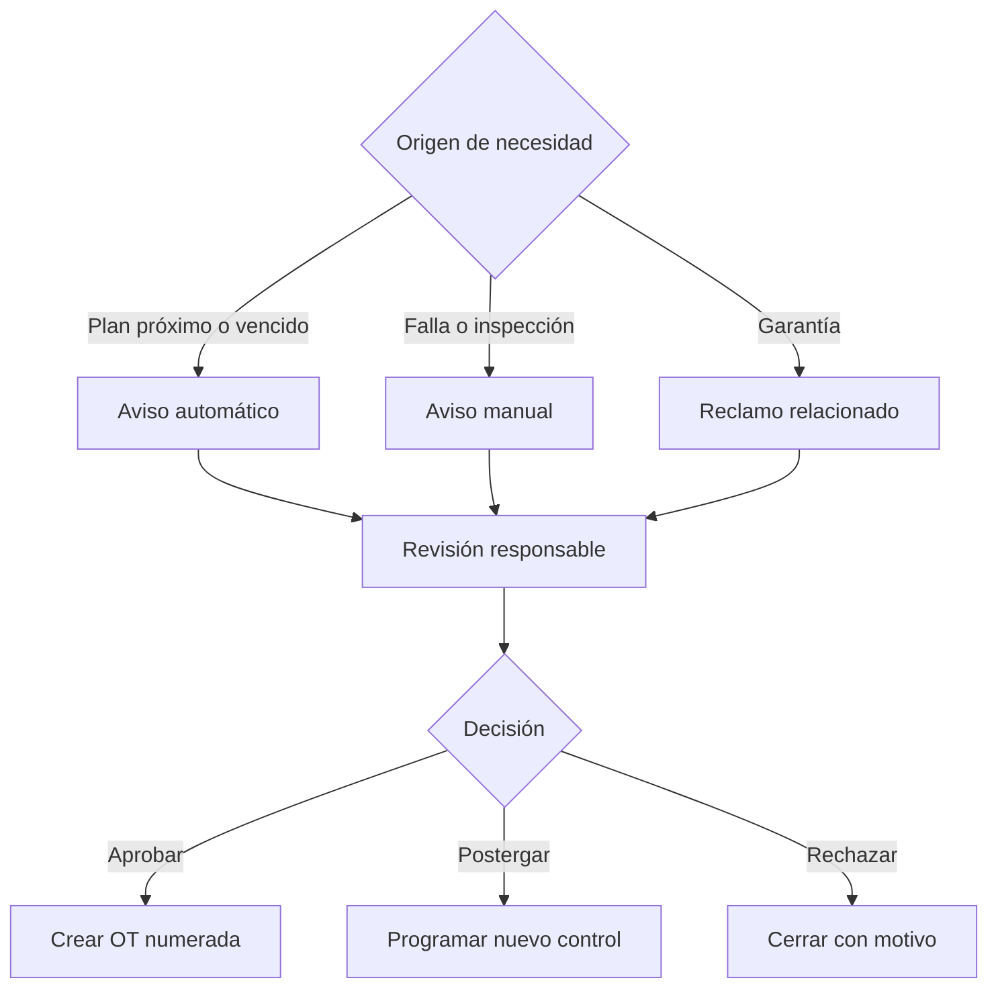

#### Cierre consistente de una orden

El cierre debe ejecutarse dentro de una única transacción. Si falla cualquier paso, no debe quedar una orden finalizada con lecturas o planes desactualizados.

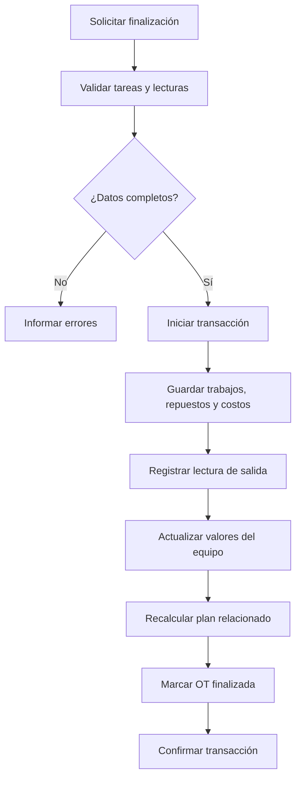

### 5.9 Garantías

La información de garantía se registra inicialmente en `orden_repuestos`. Puede vencer por fecha, kilómetros u horas.

Un repuesto se considera potencialmente en garantía mientras no se haya alcanzado ninguno de los límites configurados. Si tiene más de un límite, la garantía finaliza al cumplirse el primero.

No se implementará en esta etapa un circuito jurídico o comercial de reclamos. Sí debe poder:

- Identificar el equipo y orden donde se colocó.
- Consultar proveedor, fecha, comprobante, serie o lote.
- Detectar garantías próximas a vencer.
- Abrir una nueva orden con origen `GARANTIA` relacionada con la colocación anterior.

Si se implementa esa relación, agregar `orden_repuesto_origen_id` en la nueva orden o una tabla `reclamos_garantia`.

### 5.10 Importaciones

| Tabla | Finalidad | Campos esenciales |
|---|---|---|
| `importaciones` | Encabezado y auditoría de cada archivo procesado. | id, tipo, archivo, origen, fecha, usuario_id, estado, filas_totales, filas_validas, filas_error, resumen |
| `importacion_errores` | Errores detallados por fila. | id, importacion_id, numero_fila, campo, valor, mensaje |

**Motivo del diseño:** la importación debe ser verificable y reversible conceptualmente; no debe insertar datos sin informar qué filas fallaron.

Proceso mínimo:

1. Descargar una plantilla.
2. Subir archivo.
3. Validar encabezados, formatos y referencias.
4. Mostrar vista previa y errores por fila.
5. Confirmar importación.
6. Procesar dentro de una transacción o en lotes controlados.
7. Registrar origen, archivo, usuario y resultado.

Los duplicados deben detectarse mediante claves configuradas:

- Equipos: empresa + código interno; patente como validación adicional cuando exista.
- Lecturas: equipo + fecha/hora + valores + origen, con advertencia antes de duplicar.

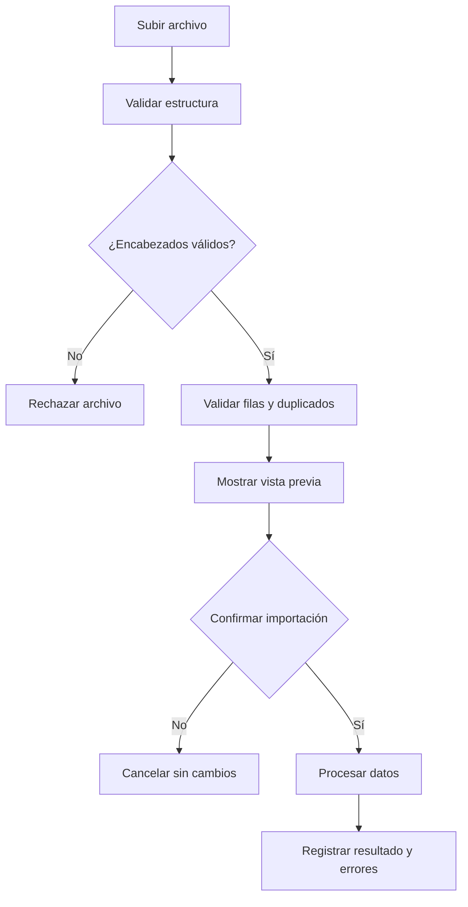

### 5.11 Alertas y auditoría

| Tabla | Finalidad | Campos esenciales |
|---|---|---|
| `configuracion_alertas` | Define destinatarios y reglas por empresa o sucursal. | id, empresa_id, sucursal_id, tipo_alerta, destinatarios, anticipacion, activo |
| `ejecuciones_programadas` | Registra inicio, fin y resultado de cada proceso automático. | id, proceso, fecha_inicio, fecha_fin, estado, resumen, detalle_error |
| `notificaciones` | Evita duplicados y conserva qué se envió y a quién. | id, tipo, entidad_tipo, entidad_id, clave_evento, destinatario, fecha_envio, estado, error |
| `auditoria` | Registra operaciones sensibles. | id, usuario_id, accion, entidad, entidad_id, valores_anteriores, valores_nuevos, ip, user_agent, fecha |

**Motivo del diseño:** las alertas deben ser idempotentes. Ejecutar dos veces el proceso no puede enviar el mismo aviso dos veces para el mismo evento.

---

## 6. Pantallas requeridas

### 6.1 Acceso y navegación

- Inicio de sesión.
- Recuperación o restablecimiento administrativo de contraseña.
- Selector de sucursal cuando el usuario tenga más de una.
- Menú visible según permisos.
- Inicio adaptado al rol: el técnico no debe atravesar paneles administrativos para llegar a su trabajo.

### 6.2 Bandeja personal y carga rápida

- Vista `Mi trabajo` con órdenes asignadas, vencidas, de hoy, próximas y en espera.
- Botón persistente `Informar falla` accesible desde teléfono.
- Selección del equipo por búsqueda, código/patente o lectura de QR.
- Formulario breve con descripción, condición operativa y adjunto.
- Aviso de posibles solicitudes duplicadas antes de confirmar.
- Confirmación visible con número y estado de la solicitud.
- Línea de tiempo con comentarios, cambios de estado y responsable.

### 6.3 Panel principal

Indicadores mínimos:

- Mantenimientos vencidos.
- Mantenimientos próximos.
- Órdenes abiertas.
- Equipos detenidos o en mantenimiento.
- Equipos sin lectura reciente.
- Solicitudes nuevas sin revisar.
- Órdenes bloqueadas por repuestos, proveedor o autorización.
- Órdenes con cierre incompleto o datos de baja calidad.

Listas de acción:

- Próximos vencimientos ordenados por urgencia.
- Órdenes demoradas.
- Garantías próximas a vencer.

Filtros:

- Empresa.
- Sucursal.
- Tipo de equipo.
- Estado.
- Rango de fechas.

### 6.4 Equipos

- Listado con búsqueda, filtros y exportación.
- Alta y edición.
- Ficha general.
- Lecturas.
- Planes preventivos.
- Órdenes e historial.
- Repuestos colocados y garantías.
- Adjuntos.
- Relaciones actuales e históricas con otros equipos.
- Código QR imprimible para abrir la ficha o informar una falla.

### 6.5 Mantenimiento

- Tipos de servicio.
- Tareas.
- Plantillas.
- Aplicación de plantilla a varios equipos.
- Planes por equipo.
- Vista de próximos, vencidos y sin datos.

### 6.6 Solicitudes y avisos

- Bandeja de nuevas, en revisión, postergadas y convertidas.
- Búsqueda de duplicados y agrupación.
- Priorización por criticidad, condición operativa y antigüedad.
- Aprobación, rechazo o postergación con motivo.
- Conversión de una o varias solicitudes en orden de trabajo.
- Seguimiento del estado por parte del solicitante.

### 6.7 Órdenes

- Listado y filtros.
- Alta manual o desde un vencimiento.
- Edición según estado.
- Cambio de estado.
- Registro de trabajos y repuestos.
- Adjuntos.
- Vista previa e impresión PDF.
- Historial de cambios.
- Vista `Mi trabajo` para técnicos.
- Inicio/pausa/reanudación con motivo de espera.
- Línea de tiempo de comentarios y novedades.
- Validación guiada del cierre.

### 6.8 Proveedores y talleres

- Listado.
- Alta, edición e inactivación.
- Historial de órdenes atendidas.

### 6.9 Importaciones

- Descarga de plantillas.
- Carga de archivo.
- Vista previa.
- Errores por fila.
- Confirmación.
- Historial de importaciones.

### 6.10 Administración

- Empresas y sucursales.
- Usuarios, roles y permisos.
- Configuración de alertas y destinatarios.
- Parámetros generales.
- Auditoría.

---

## 7. Orden de trabajo impresa

El PDF debe ser A4, legible en blanco y negro y contener:

- Empresa, sucursal y número de orden.
- Fecha de emisión y programación.
- Equipo, código interno, patente, marca y modelo.
- Kilometraje y horómetro de ingreso.
- Chofer al momento de la intervención, si fue informado.
- Taller propio o proveedor externo.
- Motivo o falla informada.
- Trabajos solicitados.
- Espacio para diagnóstico.
- Lista de tareas.
- Repuestos utilizados.
- Observaciones.
- Fechas de recepción y entrega.
- Firmas del responsable y del taller.

La versión finalizada puede incorporar los trabajos realizados, costos y lecturas de salida.

---

## 8. Alertas por correo

El proceso automático se ejecutará diariamente, inicialmente a las 07:00.

Debe controlar:

- Mantenimientos próximos.
- Mantenimientos vencidos.
- Equipos sin lectura reciente.
- Garantías próximas a vencer.
- Órdenes abiertas durante más tiempo que el umbral configurado.

Formato recomendado: un resumen por sucursal, en lugar de un correo por cada elemento.

Requisitos:

- Enlaces directos a cada registro.
- Registro del resultado de cada ejecución.
- Registro del destinatario y contenido lógico enviado.
- Prevención de envíos duplicados.
- Bloqueo para impedir ejecuciones simultáneas.
- Reintento controlado ante fallas temporales de SMTP.
- Los errores deben quedar registrados aunque no se pueda enviar el correo.
- Permitir preferencias por destinatario o rol y diferenciar resúmenes diarios de alertas críticas.
- No notificar comentarios internos o cambios menores por correo salvo suscripción explícita.

Implementación preferida: comando de CodeIgniter ejecutado por la tarea programada de Ferozo. Como alternativa, endpoint HTTPS protegido, únicamente si el hosting no permite PHP CLI.

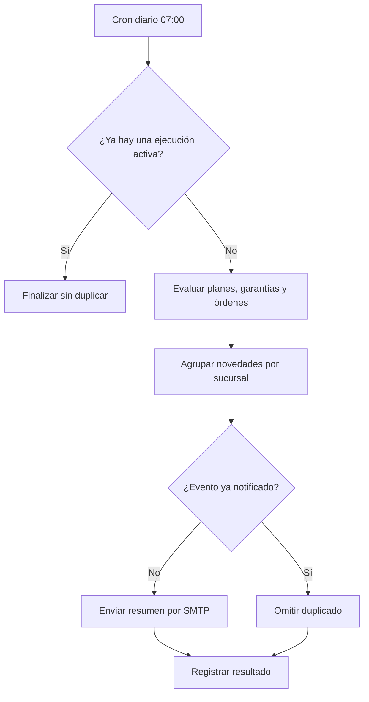

---

## 9. Reglas generales de negocio

1. No eliminar físicamente información histórica de mantenimiento.
2. Los catálogos utilizados deben inactivarse, no borrarse.
3. Las operaciones que actualicen orden, lectura y plan deben usar transacciones.
4. Un equipo dado de baja conserva todo su historial.
5. Un acoplado y un tractor tienen historiales de mantenimiento independientes.
6. No puede existir más de una relación activa incompatible para el mismo acoplado.
7. Un mantenimiento vence por el primer criterio alcanzado.
8. Los valores actuales de uso se derivan de la última lectura válida.
9. Las correcciones sensibles requieren motivo y auditoría.
10. Los adjuntos no deben ser accesibles mediante una URL pública predecible.
11. Todos los listados deben paginarse y filtrar del lado del servidor.
12. Los reportes deben respetar permisos y sucursales autorizadas.
13. Las solicitudes duplicadas deben vincularse o agruparse, no copiarse silenciosamente.
14. La prioridad del solicitante no reemplaza la clasificación del responsable.
15. Todo estado de espera debe incluir un motivo visible.
16. La interfaz de campo debe minimizar campos y clics; la información administrativa se completa durante la revisión o cierre.
17. Los indicadores no deben calcularse si faltan los datos mínimos; deben mostrar `sin datos suficientes` en lugar de inventar un valor.

---

## 10. Seguridad y calidad

- Contraseñas almacenadas con hash seguro provisto por el framework.
- Protección CSRF en formularios.
- Validación y autorización en servidor.
- Consultas parametrizadas mediante Query Builder/Modelos.
- Escape de salida para evitar XSS.
- Sesiones seguras y expiración por inactividad.
- Límite de intentos de inicio de sesión.
- Validación de tipo, tamaño y extensión real de adjuntos.
- Archivos privados fuera de `public_html` cuando el hosting lo permita; de lo contrario, carpeta protegida y descarga mediante controlador autorizado.
- Variables sensibles fuera del repositorio mediante `.env`.
- Copias de seguridad de base de datos y adjuntos.
- Registro de errores sin exponer trazas al usuario final.

---

## 11. Reportes de la primera versión

1. Mantenimientos próximos y vencidos.
2. Historial de mantenimiento por equipo.
3. Órdenes por estado, período, sucursal, equipo y proveedor.
4. Costos de mantenimiento por equipo y período.
5. Repuestos colocados por equipo.
6. Garantías vigentes y próximas a vencer.
7. Equipos sin lecturas recientes.
8. Tiempo de detención por equipo, calculado desde las órdenes cuando existan fechas válidas.
9. Solicitudes por estado, antigüedad, prioridad y equipo.
10. Tiempo desde solicitud hasta revisión y desde aprobación hasta cierre.
11. Motivos de espera y órdenes bloqueadas.
12. Calidad de datos: órdenes cerradas sin causa codificada, sin tiempos válidos o con observaciones insuficientes.

Indicadores como MTBF, MTTR o cumplimiento preventivo solo se mostrarán cuando su definición y datos mínimos estén validados. En la primera versión:

- `MTTR`: promedio de tiempo real de reparación de correctivos con inicio y fin válidos; no equivale automáticamente al tiempo total que la orden permaneció abierta.
- `Cumplimiento preventivo`: trabajos preventivos completados dentro del umbral acordado dividido por trabajos preventivos vencidos en el período.
- `Tiempo de respuesta`: tiempo entre la solicitud y su primera revisión.
- Los equipos sin horas de operación o sin fallas clasificadas no participan de métricas que requieran esos datos.

Los listados principales deben exportarse a Excel o CSV. No se requiere un constructor de reportes personalizado.

---

## 12. Entregables esperados

- Código fuente versionado en Git.
- Archivo `.env.example` sin credenciales.
- Migraciones de base de datos.
- Seeders para roles, permisos, estados y catálogos iniciales.
- Aplicación desplegable en el hosting Ferozo.
- Manual breve de instalación y actualización.
- Manual básico de usuario.
- Plantillas de importación.
- Plantilla PDF de orden de trabajo.
- Configuración documentada de la tarea programada.
- Pruebas automatizadas de las reglas críticas.
- Procedimiento de copia de seguridad y recuperación.

---

## 13. Pruebas mínimas obligatorias

El programador deberá cubrir, al menos, los siguientes casos:

1. Vencimiento únicamente por fecha.
2. Vencimiento únicamente por kilómetros.
3. Vencimiento únicamente por horómetro.
4. Vencimiento combinado donde vence primero la fecha.
5. Vencimiento combinado donde vencen primero los kilómetros.
6. Estado próximo según cada tipo de anticipación.
7. Plan sin lectura suficiente marcado como `SIN_DATOS`.
8. Rechazo de lectura inferior sin autorización.
9. Actualización transaccional de lectura actual.
10. Finalización de orden y recálculo del plan.
11. Imposibilidad de finalizar una orden incompleta.
12. Detección de orden cancelada o finalizada como no editable normalmente.
13. Numeración única ante dos altas simultáneas.
14. Prevención de duplicados en importación.
15. Prevención de correos duplicados al ejecutar dos veces el proceso.
16. Restricción de datos por sucursal.
17. Restricción de acciones por permiso.
18. Descarga autorizada de adjuntos privados.
19. Creación rápida de solicitud desde teléfono.
20. Detección y agrupación de solicitudes duplicadas.
21. Conversión trazable de una o varias solicitudes a una orden.
22. Asignación y visualización de `Mi trabajo` por técnico.
23. Rechazo de cierre correctivo sin causa, acción y resultado.
24. Registro obligatorio de motivo al poner una orden en espera.
25. Cálculo de detención solamente con fechas válidas.
26. Prevención de una tormenta de notificaciones ante ejecuciones o cambios repetidos.

---

## 14. Criterios de aceptación

La primera versión se considerará entregada cuando:

- Un administrador pueda configurar sucursales, usuarios y permisos.
- Se puedan registrar todos los tipos de equipo definidos.
- Se puedan cargar e importar lecturas de kilómetros y horas.
- Se puedan crear plantillas y aplicarlas a equipos.
- El sistema clasifique correctamente planes al día, próximos, vencidos y sin datos.
- Se pueda crear una orden preventiva o correctiva.
- Se pueda informar una falla desde el teléfono en pocos pasos y seguir su estado.
- El responsable pueda revisar, agrupar, postergar, rechazar o convertir solicitudes en órdenes.
- Cada técnico disponga de una bandeja clara con su trabajo asignado.
- Se pueda imprimir la orden y guardar su PDF.
- Se puedan registrar tareas, diagnóstico, repuestos, costos y garantías.
- Al finalizar una orden se actualicen el historial, las lecturas y el plan relacionado.
- Se pueda consultar el historial completo de un equipo.
- El panel muestre información accionable por sucursal.
- El proceso programado envíe un resumen por correo sin duplicaciones.
- Los roles y restricciones por sucursal funcionen correctamente.
- Los reportes y exportaciones acordados estén disponibles.
- Existan copias de seguridad documentadas y una instalación reproducible.
- Un piloto con equipos, planes y órdenes reales haya sido completado por usuarios finales antes del despliegue general.

---

## 15. Etapas sugeridas de desarrollo

### Etapa 1 — Base del sistema

- Proyecto, configuración y autenticación.
- Empresas, sucursales, roles y permisos.
- Catálogos generales.

### Etapa 2 — Equipos y lecturas

- Equipos, adjuntos y relaciones.
- Lecturas manuales.
- Importaciones básicas.

### Etapa 3 — Mantenimiento preventivo

- Servicios, tareas y plantillas.
- Planes y motor de vencimientos.
- Panel de próximos y vencidos.

### Etapa 4 — Órdenes de trabajo

- Solicitudes, avisos, revisión y agrupación.
- Flujo completo de órdenes.
- Tareas, repuestos, costos y garantías.
- PDF e impresión.

### Etapa 5 — Alertas, reportes y cierre

- Correos y tarea programada.
- Reportes y exportaciones.
- Auditoría, pruebas, documentación y despliegue.

Plazo comercial estimado para la primera versión: **8 a 10 semanas**, sujeto a disponibilidad de datos, validaciones y devoluciones del cliente.

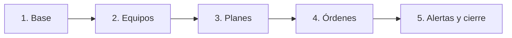

---

## 16. Supuestos y puntos a confirmar antes de programar

Estas definiciones no impiden iniciar el proyecto, pero deben confirmarse durante el relevamiento inicial:

1. Nombre de la empresa y listado inicial de sucursales.
2. Cantidad aproximada de equipos a importar.
3. Archivo real disponible desde Gestya u otro sistema.
4. Formato definitivo de numeración de órdenes.
5. Logo y datos que deben aparecer en el PDF.
6. Destinatarios y anticipaciones iniciales de los correos.
7. Plazo para considerar una lectura como desactualizada.
8. Plazo para considerar una orden como demorada.
9. Moneda de los costos; inicialmente se asumirá ARS.
10. Si los costos son obligatorios u opcionales al finalizar.
11. Política de conservación y tamaño máximo de adjuntos.
12. Credenciales SMTP y dominio/subdominio de despliegue.

Toda ampliación que modifique de forma material este alcance debe documentarse y aprobarse antes de desarrollarse.

---

## 17. Estrategia de adopción y puesta en marcha

La implementación no debe comenzar con la carga masiva de toda la empresa. Se realizará un piloto controlado con datos reales:

1. Designar un responsable interno del proyecto con capacidad para validar datos y reglas.
2. Seleccionar entre 5 y 10 equipos representativos.
3. Cargar sus lecturas, planes y últimos mantenimientos reales.
4. Ejecutar el circuito completo con al menos un preventivo y un correctivo.
5. Pedir a solicitantes y técnicos que utilicen el sistema desde sus teléfonos.
6. Medir cantidad de pasos, campos abandonados, cierres incompletos y duplicados.
7. Corregir el flujo antes de importar el resto de los equipos.
8. Capacitar por rol con ejemplos del trabajo real, no mediante una explicación general del sistema.

El piloto se considera aprobado cuando un usuario puede informar una falla, el responsable convertirla en orden y el técnico cerrarla sin asistencia del programador, conservando datos suficientes para reconstruir qué ocurrió.

---

## 18. Definición de terminado por funcionalidad

Una funcionalidad se considera terminada únicamente cuando:

- Cumple sus reglas de negocio.
- Aplica permisos y validaciones del lado del servidor.
- Incluye migración o cambio de esquema reproducible.
- Posee pruebas para sus casos críticos.
- Funciona en escritorio y móvil mediante diseño responsive.
- Maneja errores con mensajes comprensibles.
- No rompe información histórica.
- Está documentada cuando requiere configuración u operación especial.
