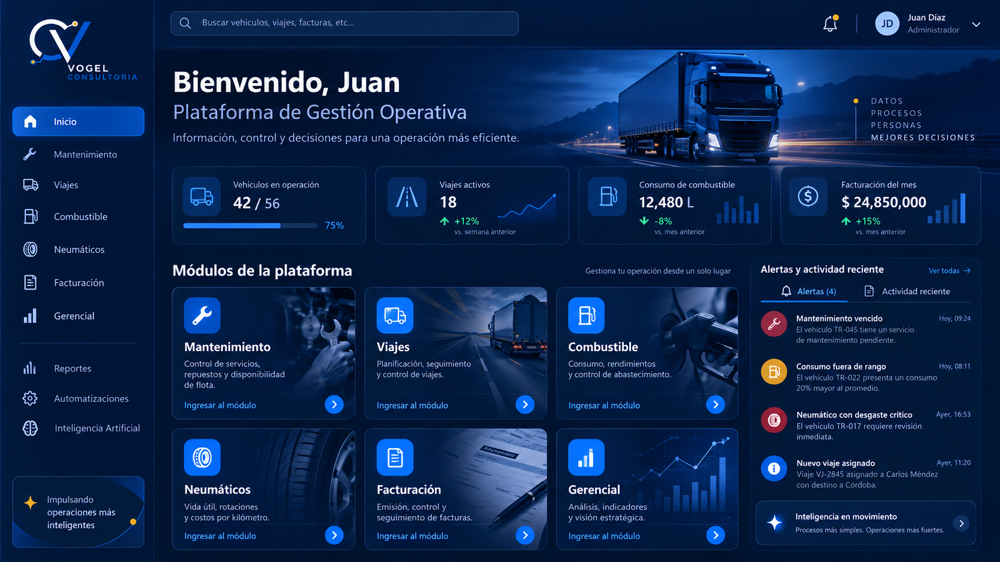
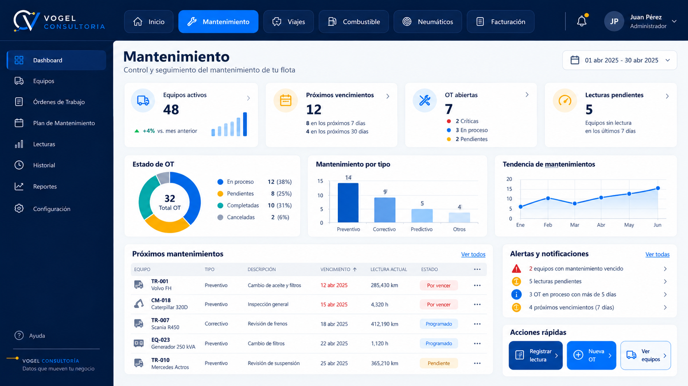
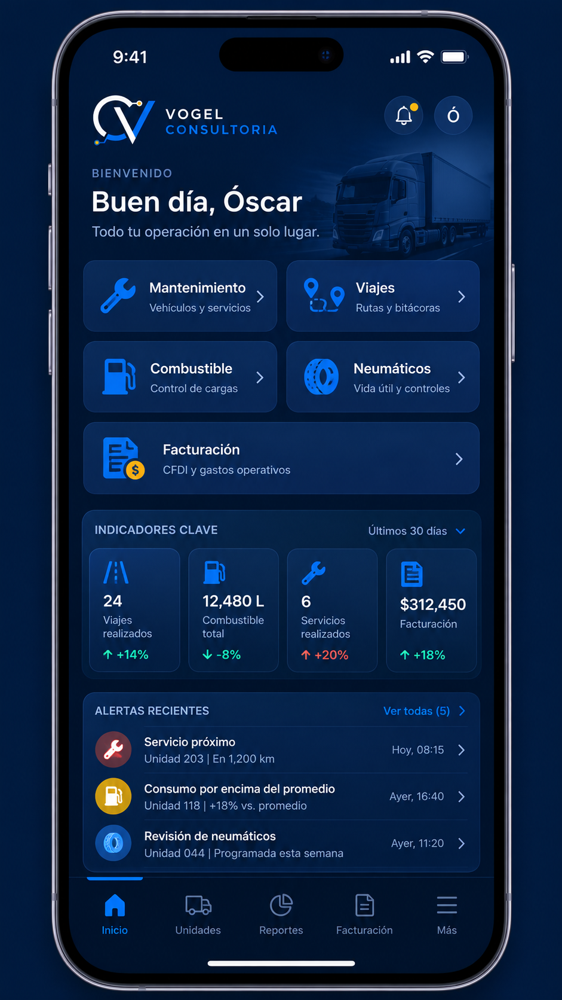

# Referencias visuales — Centro de Mandos Vogel

**Fecha:** 2026-10-08
**Estado:** referencias visuales incorporadas al repositorio. Son **propuestas de diseño**, no capturas de funcionalidades implementadas. No hay implementación aprobada.
**Relacionado con:** [Arquitectura de Plataforma de Gestión Operativa](../ARQUITECTURA_PLATAFORMA_GESTION_OPERATIVA.md).

---

## 1. Las tres referencias visuales

| Archivo | Dim. | Peso | Uso |
|---|---|---|---|
| [`portal-desktop.png`](portal-desktop.png) | 1672 × 941 px | 1,75 MB | Referencia **principal** del futuro Centro de Mandos en escritorio. |
| [`mantenimiento-desktop.png`](mantenimiento-desktop.png) | 1672 × 941 px | 1,40 MB | Referencia **histórica descartada**. Solo documenta evolución de diseño. |
| [`portal-mobile.png`](portal-mobile.png) | 941 × 1672 px | 1,41 MB | Referencia conceptual de la versión **responsive en celular**. |

Archivos PNG originales, conservados sin regenerar, recomprimir ni modificar.

---

## 2. `portal-desktop.png` — Referencia principal del Centro de Mandos

Propuesta de la pantalla inicial del futuro **Centro de Mandos** de la Plataforma Integral de Gestión Operativa. **No es una pantalla implementada.**

Debe respetarse:

- **Identidad Vogel Consultoría:** azul marino, azul intenso, blanco y detalles amarillos.
- **Tarjetas de los módulos principales:** Mantenimiento, Viajes, Combustible, Neumáticos, Facturación y Gerencial.
- **Indicadores generales** de estado de la operación.
- **Alertas y actividad reciente**, accionables y basadas en datos reales.
- **Navegación** sencilla, profesional y coherente con el lenguaje visual del producto.

---

## 3. `mantenimiento-desktop.png` — REFERENCIA HISTÓRICA DESCARTADA PARA IMPLEMENTACIÓN

> ⚠️ **ATENCIÓN: ESTA IMAGEN NO REPRESENTA EL MANTENIMIENTO ACTUAL.**

Esta imagen **NO** representa el Mantenimiento vigente. El sistema real ya cuenta con un **dashboard gerencial oscuro** con indicadores, costos, preventivos, órdenes de trabajo, lecturas y menú simplificado.

- **NO** reemplazar ni rediseñar el dashboard existente para ajustarlo a esta imagen.
- Se conserva **únicamente** para documentar la evolución del diseño y dejar identificada su condición de propuesta descartada.
- La **fuente de verdad** es el sistema actual y el código de `main`.

---

## 4. `portal-mobile.png` — Referencia responsive

Referencia conceptual de la versión **responsive** del Centro de Mandos: tarjetas de módulos, indicadores clave, alertas recientes y navegación inferior compacta.

- El resultado futuro debe respetar la identidad visual de Vogel.
- Debe funcionar correctamente en celulares.
- **No es una app móvil nativa:** es una interfaz web responsive.

---

## 5. Contrato visual para futuras implementaciones

Estas reglas son **obligatorias** para cualquier implementación futura del Centro de Mandos.

1. El nuevo Centro de Mandos debe seguir la referencia [`portal-desktop.png`](portal-desktop.png), **adaptándose a los componentes existentes**.
2. La versión móvil debe tomar como referencia [`portal-mobile.png`](portal-mobile.png).
3. **Mantenimiento debe conservar su apariencia y funcionamiento actuales.**
4. **No introducir datos ficticios**, gráficos decorativos ni indicadores sin respaldo en datos reales.
5. **No implementar módulos futuros solamente porque aparezcan en las imágenes.**
6. Mantener compatibilidad con las **rutas, permisos, dashboards y funcionalidades existentes**.
7. Verificar las futuras implementaciones mediante **capturas reales de Coolify**, comparadas con las referencias aprobadas.
8. **Corregir cualquier texto incorrecto de las imágenes**, por ejemplo referencias fiscales de otros países (usar comprobantes argentinos, nunca CFDI).
9. Utilizar el **logo oficial existente** de Vogel Consultoría, no recreaciones generadas por IA.
10. Las imágenes **sirven como referencia visual; no autorizan modificaciones funcionales**.

---

## 6. Corrección prioritaria — 2026-10-08

**Fuente de verdad para Mantenimiento: la pantalla real de la aplicación vigente, no la propuesta generada.** El usuario comparó la imagen conceptual clara con una captura real del dashboard oscuro que ya incluye tarjetas de Equipos activos, Cumplimiento, Preventivos vencidos, OT abiertas y Lecturas pendientes; Resumen financiero del mes, evolución de costos, Top 5 equipos por costo y Salud del mantenimiento preventivo, además de menú lateral simplificado y chatbot flotante.

**No rediseñar ni reemplazar el dashboard, navegación interna, indicadores, resumen financiero, gráfico de gastos, alertas, estilo oscuro o funciones de Mantenimiento para implementar el portal.** La primera fase agrega únicamente un nivel superior `/inicio` y un acceso para volver al portal/cambiar de módulo, insertado de modo discreto y sin degradar el diseño existente. El portal de módulos puede tomar inspiración de `portal-desktop.png` y `portal-mobile.png`, pero debe adaptar sus colores/componentes al lenguaje visual real, no imponer otra UI.

**Validación obligatoria:** comparar contra la pantalla actual obtenida de la aplicación desplegada y contrastar flujo y enlaces con el repositorio, antes de aceptar diseño. Las cifras del mockup NO son datos reales.

---

## 7. Requisitos visuales que se deben respetar

- Identidad basada en el **logo proporcionado de Vogel Consultoría**: azul marino profundo, azul intenso, blanco y acentos amarillos muy contenidos.
- Diseño corporativo y tecnológico, legible y sobrio; gradientes y fotografías discretos, nunca a costa de las tareas operativas.
- **Inicio independiente del módulo Mantenimiento**: el portal presenta módulos y estado global; dentro de Mantenimiento, conservar los flujos actuales.
- **Tarjetas de módulo**: Mantenimiento, Viajes, Combustible, Neumáticos, Facturación y Gerencial; mostrar solo lo autorizado y habilitado, no tarjetas funcionales falsas.
- Menú por módulo en escritorio y navegación compacta en móvil.
- KPIs **solo con datos existentes**, permiso apropiado y fuente confiable; no usar métricas ficticias en producción.
- Alertas accionables basadas en permisos y datos reales; no alertas decorativas.
- Soportar tema claro/oscuro y contraste accesible. La propuesta oscura es inspiración de marca, no obligación de mostrar todas las pantallas oscuras.
- Evitar traducciones erróneas: utilizar **facturación/comprobantes argentinos**, nunca CFDI u otras denominaciones ajenas a Argentina.
- Nombre de persona, fechas y cifras mostradas en los conceptos son **ilustrativos**, no datos reales.
- El logo del material generado debe contrastarse con el SVG/activo oficial existente; nunca reemplazar el logo oficial con una interpretación defectuosa de una imagen generada.

---

## 8. Criterios de aceptación visual futura

1. Comparar el **nuevo portal** lado a lado con el concepto aprobado (escritorio y móvil); comprobar **Mantenimiento** contra la captura/implementación real, jamás contra el mockup descartado.
2. Mantener jerarquía, distribución, espaciado, colores de marca, accesibilidad y navegación general.
3. Corregir incongruencias de textos/monedas/fotografías que las imágenes conceptuales puedan contener.
4. Confirmar que las tareas actuales del usuario siguen siendo rápidas y el nuevo portal no agrega pasos obligatorios innecesarios.
5. Verificar permisos, enlaces profundos, QR, cron y compatibilidad de rutas; la fidelidad visual **no sustituye** las pruebas funcionales.
6. No desplegar en Ferozo antes de validar en Coolify.

---

## 9. Procedencia de los archivos

Las tres imágenes provienen del archivo `referencias_visuales_vogel.zip` entregado para esta tarea. Se extrajeron los originales y se incorporaron con su resolución original, sin regenerarlos ni recomprimirlos. El ZIP **no** se versiona en el repositorio.

| Archivo | SHA-256 (primeros 16) |
|---|---|
| `portal-desktop.png` | `6549DCA832DE8640` |
| `mantenimiento-desktop.png` | `2ED1190087B9667B` |
| `portal-mobile.png` | `543872F80A3F7266` |

**Esta tarea es exclusivamente documental.** No implementa pantallas, no modifica funcionalidades y no despliega.